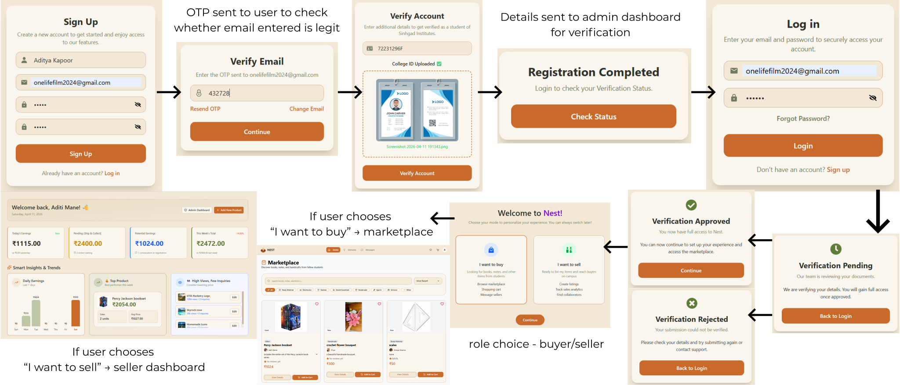
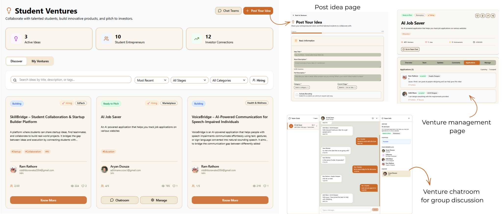
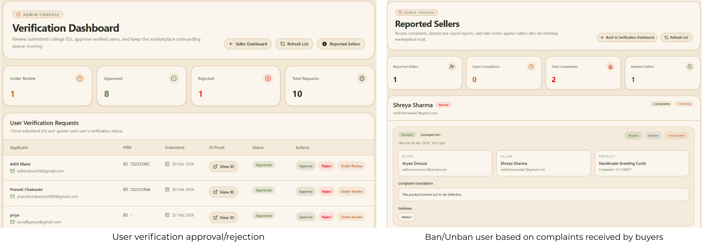

# NEST – Student Marketplace & Startup Innovation Hub

<p align="center">
  
  
  
  
  
  
  
  
  
  
</p>

> **NEST** is a full-stack web platform designed to empower students to start, manage, and grow their small businesses within a college ecosystem. It combines a peer-to-peer marketplace for buying and selling products with a collaborative hub for student startup ventures.

---
🌐 Live Website: https://www.nestplatform.website/

## 📌 Table of Contents

- [About the Project](#-about-the-project)
- [Features](#-features)
- [Tech Stack](#-tech-stack)
- [Project Structure](#-project-structure)
- [Getting Started](#-getting-started)
  - [Prerequisites](#prerequisites)
  - [Installation (Local)](#installation-local)
  - [Running with Docker](#running-with-docker)
- [Module Overviews](#-module-overviews)
- [Environment Variables](#-environment-variables)
- [Contributing](#-contributing)
- [Team](#-team)


---

## 🧭 About the Project

NEST was built as an academic initiative by a 4-member student team. The platform addresses a real gap in college ecosystems: there's no centralized, trusted space for students to buy/sell products, share entrepreneurial ideas, or collaborate on ventures. NEST solves this by bringing together a marketplace, venture showcase, and admin management layer in one unified platform.

---

## ✨ Features

- **🔐 Authentication** – Secure JWT-based login and registration with bcrypt password hashing; role-based access for Buyers, Sellers, and Admins.
- **🛒 Buyer Module** – Browse listings, search products, place orders, and communicate with sellers in real time.
- **🏪 Seller Module** – Create and manage product listings, track orders, view AI-powered sales analytics, and chat with buyers.
- **✉️ OTP Order Verification** – Order completion is secured via a one-time password sent to the buyer's email through Nodemailer, which the seller enters to confirm delivery.
- **💬 Real-time Chat** – Socket.io-powered messaging between buyers and sellers on the marketplace, plus a dedicated team chat channel for venture collaborators.
- **💡 Ventures Hub** – Post and explore student startup ideas, connect with collaborators, and communicate via built-in team chat.
- **🛡️ Admin Dashboard** – Manage users, listings, and platform-wide settings from a dedicated admin interface.
- **🤖 ML Recommendation Engine** – Python FastAPI microservice using Sentence-BERT (`all-MiniLM-L6-v2`) to rank similar products by semantic cosine similarity, with graceful fallback to rating-based sorting.
- **🧠 Sentiment Analysis** – NLP microservice powered by `cardiffnlp/twitter-roberta-base-sentiment` (RoBERTa) that classifies reviews, computes seller happiness scores (0–10), and extracts positive/negative themes.
- **📈 Sales Analytics Dashboard** – JS-based forecasting engine using linear regression (with R² confidence scoring) for 7-day, 30-day, and 3-month revenue predictions, plus Gemini AI-powered business suggestions.
- **⚡ Redis Caching** – Redis is used to cache sessions and frequently accessed data, reducing database load and improving response times.
- **🌐 Nginx Reverse Proxy** – Production-ready routing between frontend, backend, and ML services.
- **🐳 Docker Support** – Fully containerized for consistent development and production deployments.

---

## 🛠 Tech Stack

| Layer | Technology |
|---|---|
| **Frontend** | React.js, Tailwind CSS |
| **Backend** | Node.js, Express.js |
| **Database** | MongoDB |
| **Caching** | Redis |
| **Real-time** | Socket.io |
| **Authentication** | JWT, bcrypt |
| **Email / OTP** | Nodemailer |
| **ML Microservices** | Python, FastAPI, HuggingFace Transformers |
| **ML Models** | `all-MiniLM-L6-v2` (Sentence-BERT), `cardiffnlp/twitter-roberta-base-sentiment` (RoBERTa) |
| **AI Suggestions** | Google Gemini API |
| **Reverse Proxy** | Nginx |
| **Containerization** | Docker, Docker Compose |
| **Dev Tools** | Postman, GitHub |

---

## 📁 Project Structure

```
nest-platform/
├── assets/                    # Flow diagrams and design assets (SVG)
│   ├── auth-flow.svg
│   ├── seller-buyer-flow.svg
│   ├── ventures-flow.svg
│   └── admin-pages.svg
│
├── frontend/                  # React.js client application
│   └── ...
│
├── backend/                   # Node.js / Express REST API
│   └── ...
│
├── ml-services/               # Python ML microservice
│   └── ...
│
├── nginx/                     # Nginx reverse proxy config
│   └── ...
│
├── docker-compose.yml         # Production Docker Compose config
├── docker-compose.dev.yml     # Development Docker Compose config
├── package.json               # Root-level scripts / workspace config
└── README.md
```

---

## 🚀 Getting Started

### Prerequisites

Make sure you have the following installed:

- [Node.js](https://nodejs.org/) (v18+)
- [npm](https://www.npmjs.com/) or [yarn](https://yarnpkg.com/)
- [MongoDB](https://www.mongodb.com/) (local instance or MongoDB Atlas)
- [Redis](https://redis.io/) (local instance or Redis Cloud)
- [Docker & Docker Compose](https://www.docker.com/) *(for containerized setup)*
- [Python 3.9+](https://www.python.org/) *(for ML services)*

---

### Installation (Local)

**1. Clone the repository**

```bash
git clone https://github.com/Aditi-Mane/nest-platform.git
cd nest-platform
```

**2. Set up the backend**

```bash
cd backend
npm install
```

Create a `.env` file inside the `backend/` directory (see [Environment Variables](#-environment-variables)).

```bash
npm run dev
```

The backend server will start at `http://localhost:5000`.

**3. Set up the frontend**

```bash
cd ../frontend
npm install
npm start
```

The React app will start at `http://localhost:3000`.

**4. Set up ML services** *(optional)*

```bash
cd ../ml-services
pip install -r requirements.txt
python app.py
```

---

### Running with Docker

NEST includes Docker Compose configurations for both development and production environments.

**Development:**

```bash
docker-compose -f docker-compose.dev.yml up --build
```

**Production:**

```bash
docker-compose up --build
```

This will spin up all services (frontend, backend, MongoDB, Redis, ML services, and Nginx) in isolated containers.

---

## 🗂 Module Overviews

### 🔐 Authentication Flow
Role-based registration and login for Students (Buyers/Sellers) and Admins. JWT tokens are issued on login and verified for protected routes. Passwords are hashed using bcrypt.



---

### 🛒 Seller–Buyer Module
Sellers can create and manage product listings. Buyers can browse the marketplace, search by category, and place orders. Each user's dashboard reflects their active role.

💬 Real-time Messaging
Socket.io powers two distinct chat experiences on the platform. Buyers and sellers can message each other directly about a product or order from within the marketplace. Venture team members have a dedicated group chat channel tied to their venture, enabling async collaboration.

✉️ OTP Order Verification
When a buyer receives their order, the seller must confirm delivery by entering a one-time password sent to the buyer's email via Nodemailer. This prevents fraudulent order-completion claims and adds a layer of trust to every transaction on the platform.


---

### 💡 Ventures Module
Students can publish their startup ideas as venture posts, describe their vision, and invite collaborators. Other students can browse and express interest in joining ventures. Each active venture has a built-in real-time team chat (Socket.io) so members can coordinate without leaving the platform.



---

### 🛡️ Admin Dashboard
Admins can monitor and moderate the platform — reviewing new listings, managing user accounts, and overseeing activity across the marketplace and ventures hub.



---


## 🔑 Environment Variables

Create a `.env` file in the `backend/` directory with the following variables:

```env
# Server
PORT=5000
NODE_ENV=development

# MongoDB
MONGO_URI=mongodb://localhost:27017/nest-platform

# JWT
JWT_SECRET=your_jwt_secret_here
JWT_EXPIRES_IN=7d

# Redis
REDIS_URL=redis://localhost:6379

# Nodemailer (OTP email delivery)
EMAIL_HOST=smtp.gmail.com
EMAIL_PORT=587
EMAIL_USER=your_email@gmail.com
EMAIL_PASS=your_app_password

# ML Service (Python FastAPI)
ML_SERVICE_URL=http://localhost:8000

# Google Gemini AI (optional — falls back to rule-based suggestions if absent)
GEMINI_API_KEY=your_gemini_api_key_here
```

> ⚠️ Never commit your `.env` file to version control. It is already included in `.gitignore`.

---

## 🤝 Contributing

Contributions are welcome! Here's how to get started:

1. **Fork** the repository.
2. **Create** a new branch for your feature or bug fix:
   ```bash
   git checkout -b feature/your-feature-name
   ```
3. **Commit** your changes with a clear message:
   ```bash
   git commit -m "feat: add product search filter"
   ```
4. **Push** to your fork:
   ```bash
   git push origin feature/your-feature-name
   ```
5. **Open** a Pull Request against the `main` branch.

Please make sure your code follows the existing code style and that all existing functionality still works before submitting a PR.

---

## 👩‍💻 Team

NEST is developed by a 4-member student team as part of an academic initiative.

---

<p align="center">Made with ❤️ by students, for students.</p>


